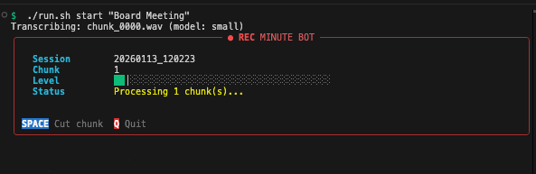

# Minute Bot

Automated meeting minutes generator for board meetings.



## Problem Being Solved

Doug is secretary on two boards and needs to create meeting minutes. Current workflow:
1. Record meetings with KRISP
2. Manually stop/start KRISP to get incremental transcripts
3. Write minutes from transcripts

**Goal**: Automate this so that every N minutes:
1. Audio is captured and transcribed locally (Whisper - works offline)
2. Minutes are updated incrementally via Claude API (when online)
3. System is fault-tolerant (queues transcripts when offline)

## Architecture

```
┌─────────────┐     ┌─────────────┐     ┌─────────────┐
│   SoX       │────▶│   Whisper   │────▶│  Claude API │
│  (record)   │     │ (transcribe)│     │  (minutes)  │
└─────────────┘     └─────────────┘     └─────────────┘
     │                    │                    │
     ▼                    ▼                    ▼
   audio/              transcripts/         minutes/
   chunks               .txt files          .md files

                    [Offline Queue]
                    (persisted to disk)
```

## Components

- **recorder.py**: Records audio in N-second chunks using SoX
- **transcriber.py**: Transcribes audio using Whisper CLI (homebrew)
- **minutes_generator.py**: Updates minutes via Claude API, queues when offline
- **minute_bot.py**: Main CLI tying everything together
- **config.py**: Configuration (paths, models, durations)

## Quick Setup with Claude Code

If you have [Claude Code](https://claude.ai/code) installed, just say:

> "set up the project"

Claude will install all dependencies, download models, and configure everything.

## Manual Prerequisites

- macOS (Intel or Apple Silicon)
- whisper-cpp: `brew install whisper-cpp`
- SoX for audio recording: `brew install sox`
- Python 3.x with venv (anthropic package)

Download a whisper model (small.en recommended):
```bash
mkdir -p ~/.cache/whisper-cpp
curl -L -o ~/.cache/whisper-cpp/ggml-small.en.bin \
  "https://huggingface.co/ggerganov/whisper.cpp/resolve/main/ggml-small.en.bin"
```

## Usage

```bash
# Test microphone
./run.sh test-mic

# Record a meeting (5-minute chunks by default)
./run.sh record "Board Meeting"

# Record with 3-minute chunks
./run.sh record "HOA Meeting" --chunk-duration 180

# Use a different Whisper model
./run.sh record "Meeting" --model medium

# Transcribe a single file
./run.sh transcribe /path/to/audio.wav
```

## Configuration

Set your Anthropic API key (add to your shell profile for persistence):
```bash
export ANTHROPIC_API_KEY="your-key-here"
```

Or create a `.env` file in this directory:
```bash
echo 'ANTHROPIC_API_KEY=your-key-here' > .env
```

Edit `config.py` to change:
- `CHUNK_DURATION_SECONDS`: How often to process (default: 300 = 5 min)
- `WHISPER_MODEL`: tiny, base, small, medium, large (default: small)
- `DEFAULT_TEMPLATE`: Meeting minutes template

## Offline / Fail-Safe Behavior

**Recording NEVER stops due to network issues.** The system is designed to be fault-tolerant:

1. **Audio always saved** - Chunks are saved to disk immediately
2. **Raw transcript backup** - Every transcript is saved to `{session}_raw.txt` before API calls
3. **Local transcription** - Whisper runs locally, works without internet
4. **Automatic queuing** - If Claude API fails, transcripts queue to disk
5. **Graceful errors** - Connection errors, timeouts, rate limits all handled
6. **Later processing** - Run `./run.sh process-queue` when back online

What you'll see if offline:
```
  [Queued] no internet connection (queue size: 1)
```

To process queued transcripts when back online:
```bash
./run.sh process-queue
```

## Files Generated

After a session in `data/`:
- `audio/{session_id}/chunk_XXXX.wav` - Audio chunks
- `audio/{session_id}/full_session_backup.wav` - Continuous backup recording
- `transcripts/{session_id}/chunk_XXXX.txt` - Individual chunk transcripts with timestamps
- `transcripts/{session_id}/full_transcript.txt` - Combined transcript
- `transcripts/{session_id}/raw_backup.txt` - Raw transcript backup (fail-safe)
- `minutes/{session_id}_{meeting_name}.md` - Generated minutes (with start/end times)
- `{session_id}_offline_queue.json` - Queued chunks (if offline)

## Next Steps / TODO

- [ ] Add custom templates per board (HOA vs other board)
- [ ] Add speaker diarization (who said what)
- [ ] Menu bar app version
- [ ] Support for external microphones (Yeti selection)
- [ ] Web interface to view/edit minutes in real-time
